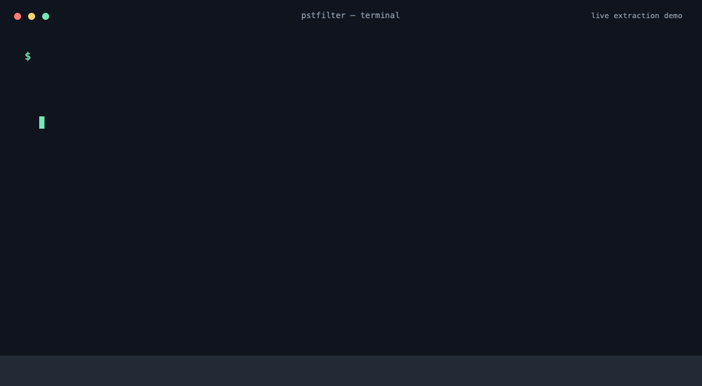

# PSTFilter

**Filter huge Outlook PST files by subject/body keywords—or convert every
email—and export compact, AI-ready JSONL and Markdown locally.**

Each keyword gets its own independent result set. PSTFilter scans the archive
only **once**, streaming, with bounded memory — memory usage stays bounded
instead of scaling with PST size, making it suitable for multi-GB PST files.

- No OpenAI / Anthropic / any LLM required
- No Outlook required
- No cloud upload, no telemetry, no API keys
- Everything runs locally and offline

## CLI demo

This is a real local extraction run against the sample PST bundled with
`pst-extractor`:



## Install

Requires **Node.js >= 20**.

Run it directly with `npx` (no install needed):

```bash
npx pstfilter extract archive.pst -k Graylog
```

Or install it globally:

```bash
npm install -g pstfilter
pstfilter extract archive.pst -k Graylog
```

> **Windows:** if PowerShell blocks `npx.ps1` due to its execution policy, use
> `npx.cmd pstfilter ...` instead.

### From source

```bash
git clone https://github.com/leafstark/pstfilter.git
cd pstfilter
npm install
npm run build
```

## Usage

```bash
pstfilter extract archive.pst \
  --keyword "Graylog" \
  --keyword "Kubernetes" \
  --keyword "Incident"
```

Or read keywords from a file:

```bash
pstfilter extract archive.pst --keywords-file keywords.txt
```

Or explicitly export every email without keyword filtering:

```bash
pstfilter extract archive.pst --all
```

Full export is opt-in because PST archives can be very large. Omitting both a
keyword source and `--all` is an error, and `--all` cannot be combined with
`--keyword` or `--keywords-file`.

`keywords.txt` — blank lines ignored, lines beginning with `#` are comments:

```
# Observability
Graylog
Grafana

# Infrastructure
Kubernetes
```

During development you can run without building:

```bash
npm run dev -- extract archive.pst -k Graylog -o ./output
```

## Output

```
output/
├── manifest.json
├── graylog/
│   ├── emails.jsonl      # one JSON object per line (streamable)
│   ├── stats.json
│   └── chunks/
│       ├── chunk-0001.md # AI-friendly Markdown, upload to ChatGPT/Claude
│       └── ...
├── kubernetes/
│   └── ...
└── incident/
    └── ...
```

An email whose subject is `Graylog incident follow-up` is written into **both**
`output/graylog/` and `output/incident/`, but never `output/kubernetes/`.

With `--all`, every email is written once under `output/all/`; its
`matchedKeywords` field is an empty array because no keyword matching occurred.

## Options

| Option | Description | Default |
| --- | --- | --- |
| `-k, --keyword <value>` | Keyword; repeatable | — |
| `--keywords-file <path>` | Read keywords from a text file | — |
| `--all` | Export every email without keyword filtering | off |
| `-o, --output <path>` | Output directory | `./pstfilter-output` |
| `--case-sensitive` | Case-sensitive matching | off |
| `--regex` | Treat keywords as regular expressions | off |
| `--subject-only` | Search only the subject | off |
| `--body-only` | Search only the body | off |
| `--no-strip-html` | Keep HTML bodies raw instead of converting to text | (strip on) |
| `--strip-quoted-replies` | Remove quoted reply chains | off |
| `--chunk-emails <n>` | Emails per Markdown chunk | `200` |
| `--chunk-chars <n>` | Characters per Markdown chunk | `1000000` |
| `--no-jsonl` | Disable JSONL output | (jsonl on) |
| `--no-markdown` | Disable Markdown output | (markdown on) |
| `--overwrite` | Replace this run's output subdirectories if they already exist | off |
| `--quiet` / `--verbose` | Logging verbosity | normal |
| `--max-emails <n>` | Stop after N emails (testing/debugging) | — |

`--subject-only` and `--body-only` together is a configuration error. `--all`
is mutually exclusive with `--keyword` and `--keywords-file`.

## Exit codes

| Code | Meaning |
| --- | --- |
| `0` | Success |
| `1` | Completed with recoverable per-email errors |
| `2` | Invalid CLI / configuration |
| `3` | PST open / parser fatal error |
| `4` | Output filesystem error |
| `130` | Interrupted by user (Ctrl-C) — partial output flushed |

## Development

```bash
npm test        # run unit + integration tests
npm run lint    # eslint
npm run typecheck
npm run build   # emit dist/
```

## Scope

V0.2 implements streaming extraction, opt-in full-archive conversion,
HTML→text, independent multi-keyword substring matching (with optional
`--regex`), JSONL + Markdown output, statistics, progress reporting, graceful
error handling and Ctrl-C flushing.

Attachment binaries are **not** extracted — only filename/size metadata is
recorded. See [docs/architecture.md](docs/architecture.md) for design details
and [docs/output-format.md](docs/output-format.md) for the output contract.

## License

MIT — see [LICENSE](LICENSE).
